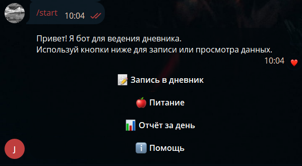

## 🚀 Быстрый старт

1. Добавьте бота: [@Journal_for_a_psychologist_bot](https://t.me/Journal_for_a_psychologist_bot)
2. Основные команды:
   ```bash
   /start - начать работу
   /report - получить дневной отчет
   
3. Пример сессии:

